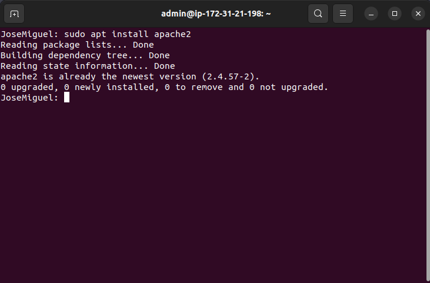
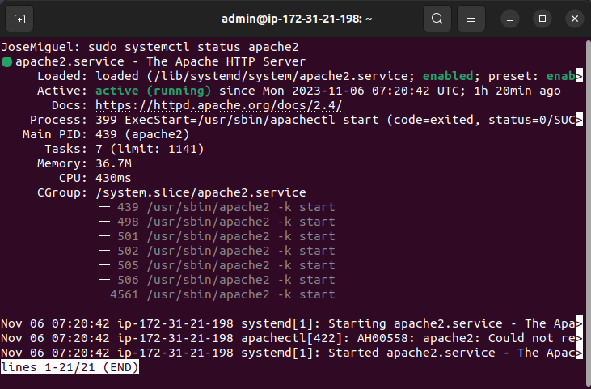

# Instalación de Apache2

## Pasos a seguir

1. Actualizamos los paquetes

"sudo apt update"

"sudo apt upgrade"

2. Instalamos Apache 2

"sudo apt install apache2"

3. Comprobamos su estado
  - Aquí comprobaremos si el servicio está activo

"sudo systemctl status apache2"

4. Encendemos Apache2
  - Esto lo haremos si el servicio no está activo

"sudo systemctl start apache2"
