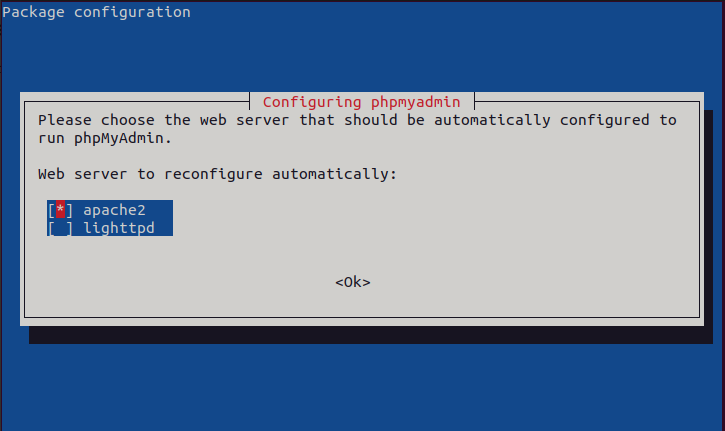

# Instalación PHPMyAdmin

1. Instalamos PHPMyAdmin

"sudo apt install phpmyadmin"

2. Habilitar PHP en Apache2

"sudo a2enmod php"

3. Habilitar las extensiones PHP en PHPMyAdmin

"sudo phpenmod mbstring"

"sudo phpenmod zip"
